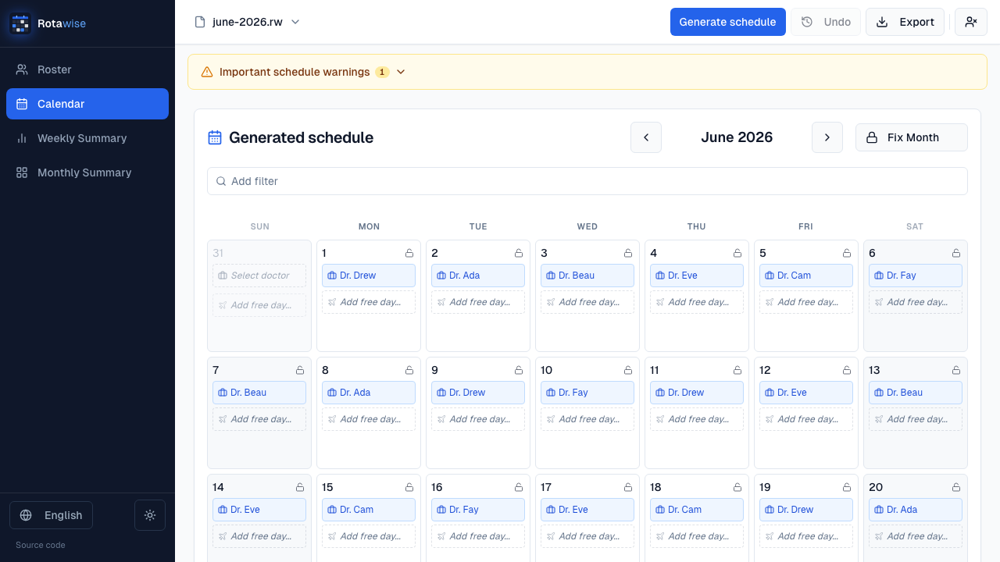
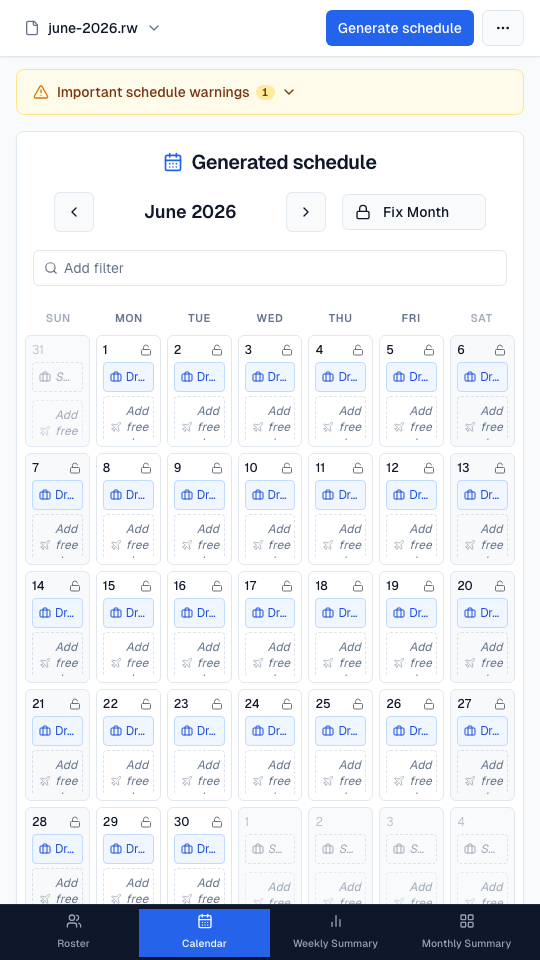

# Rota-Wise

A client-side PWA for **fair doctor on-call scheduling**. It builds a rota over
a date range while respecting rest intervals, free days, pre-assignments, and
optional post-call coverage per medical unit.

There is **no backend**. Rosters live on the device (IndexedDB) and, if you
choose, in a `.rw` file on disk. The same app runs as a PWA in the browser
or as a native desktop window via Deno Desktop.

**Live app:** [rotawise.fasl.dev](https://rotawise.fasl.dev)



<p align="center">
  
</p>

> **Not a medical device.** Generated schedules are a planning aid. Always
> review warnings, uncovered days, and departmental rules before publishing a
> rota. Do not commit real staff rosters to git.

## Features

- **Constraint-aware generator** — hard rest / post-call / coverage rules, soft fairness scoring, weighted sampling so consecutive runs can differ
- **Medical units** — weekday post-call headcount, allied units that share a pool, temporary cover assignments
- **Interactive calendar** — colour-coded chips, drag-and-drop, pinning, coverage dots
- **Summaries** — workdays by weekday and by month, with an optional date filter
- **Export** — Word (`.docx`) calendar, generated in the browser
- **Save / load** — working copy in the browser; optional `.rw` auto-save via the File System Access API
- **Offline PWA** — Workbox precache; full app after the first visit
- **Desktop app** — optional `deno desktop` wrapper around the same SPA
- **English and Spanish**, light / dark / system theme

## Tech stack

Vite 6 · React 19 · TypeScript · Tailwind CSS + Radix (shadcn/ui) · date-fns ·
react-hook-form + Zod · `docx` · vite-plugin-pwa / Workbox · **Bun** (install,
dev, test) · optional **Deno ≥ 2.9** (`deno desktop`)

Geist Sans and Geist Mono are bundled under the SIL Open Font License 1.1
([`src/assets/fonts/OFL.txt`](src/assets/fonts/OFL.txt)).

## Quick start

**Prerequisite:** [Bun](https://bun.sh) ≥ 1.1

```bash
bun install
bun run dev        # http://localhost:5173
```

| Command | Description |
|---|---|
| `bun run dev` | Vite dev server |
| `bun run build` | Production build → `dist/` |
| `bun run preview` | Serve the production build |
| `bun run lint` | ESLint |
| `bun run typecheck` | TypeScript (app + node + tests) |
| `bun test` | Unit tests (bun test + happy-dom) |
| `bun run e2e` | Playwright journeys (Chromium) |
| `bun run desktop:dev` | Native window + Vite HMR (Deno ≥ 2.9) |
| `bun run desktop:build` | Production SPA (no service worker) → `release/` |
| `bun run e2e:desktop` | Playwright against the Deno Desktop CEF webview |

Verify a change with `lint` → `typecheck` → `test`.

### Desktop app

The web PWA and the desktop app share the React SPA. Scheduling still runs in
the Web Worker inside the webview; Deno only serves files and owns the window.

```bash
# prerequisite: Deno 2.9 or later (https://docs.deno.com)
bun run desktop:dev      # development, Vite HMR in a native window
bun run desktop:build    # production binary in release/
```

`deno desktop` is experimental. The default backend is the OS webview (WebView2
on Windows, WebKit on macOS/Linux). Chromium File System Access auto-save may
be missing there; Open/Save still work via the file input and a download. Pass
`--backend cef` to `deno desktop` if you need bundled Chromium.

See [`docs/architecture.md`](docs/architecture.md) (ADR 14).

## How scheduling works

Each unassigned day, eligible doctors are filtered with **hard** rules (free
days, excluded dates, minimum interval, post-call, unit coverage look-ahead).
Survivors receive a **fairness score** (weekday balance, preferred days,
weekends, monthly load, idle time). The chosen doctor is drawn with
**weighted random sampling** so higher scores are favoured but not exclusive.

Full specification: [`docs/algorithm.md`](docs/algorithm.md).

## Architecture in brief

- SPA only: `src/main.tsx` → `src/rotawise-page.tsx`
- `generateSchedule` runs in a **Web Worker** (`src/workers/schedule.worker.ts`)
- Calendar, summaries, and Word export are **lazy-loaded** (Roster tab is the form)
- Persistence: IndexedDB always; optional bound `.rw` file on Chromium

Details: [`docs/architecture.md`](docs/architecture.md) ·
[`docs/file-format.md`](docs/file-format.md) ·
[`docs/privacy.md`](docs/privacy.md)

## Documentation

| Doc | Topic |
|---|---|
| [docs/README.md](docs/README.md) | Index |
| [docs/algorithm.md](docs/algorithm.md) | Scheduler specification |
| [docs/architecture.md](docs/architecture.md) | Modules and ADRs |
| [docs/usability.md](docs/usability.md) | UX decisions |
| [docs/ui-reference.md](docs/ui-reference.md) | Screens and controls |
| [docs/file-format.md](docs/file-format.md) | `.rw` JSON |
| [docs/privacy.md](docs/privacy.md) | Local data handling |
| [CONTRIBUTING.md](CONTRIBUTING.md) | How to contribute |

## Deploy

Static hosting of `dist/` after `bun run build`:

- **Vercel** (this repo includes `vercel.json` with service-worker cache headers)
- Netlify, Cloudflare Pages, GitHub Pages
- Store packaging via [PWABuilder](https://www.pwabuilder.com/) if needed

The service worker precaches JS/CSS/HTML/fonts/icons. After the first load the
app runs offline; roster data is already local.

## License

[GNU Affero General Public License v3.0 or later](LICENSE) © Francisco Sánchez

That is a **strong copyleft** license:

- You may use, study, modify, and share the program.
- If you distribute it, or a work based on it (including using all or part of
  this code inside another product), the **complete corresponding source** of
  that combined work must be offered under the AGPL.
- If you host a modified version so people use it over the network (a website
  or PWA), you must offer those users the source of the version they interact
  with (AGPL section 13).

Please follow the [Code of Conduct](CODE_OF_CONDUCT.md). Security reports:
[SECURITY.md](SECURITY.md).
